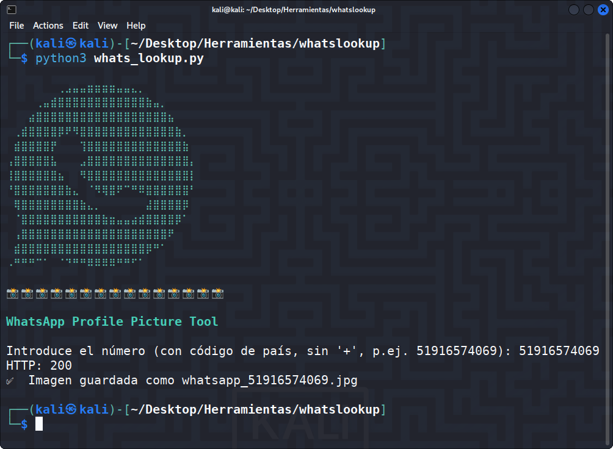
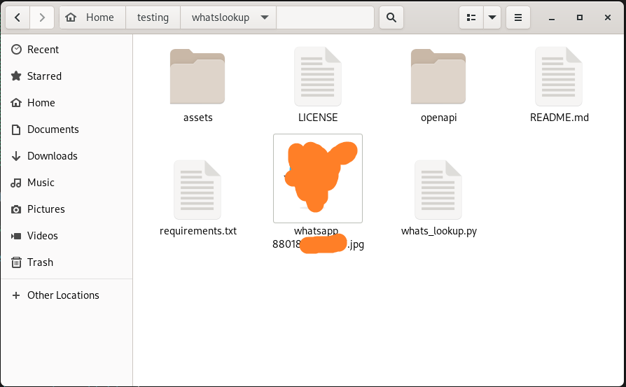

<h1 align="center">WHATS LOOKUP 🕵️‍♂️</h1>

<p align="center">
  Herramienta de OSINT para WhatsApp que permite obtener fotos de perfil mediante número de teléfono usando la API <strong>Whatsapp OSINT</strong> de RapidAPI.
</p>

<p align="center">
  
</p>

<p align="center">
  
  
  
</p>

---

## 🚀 Características

- Obtención de fotos de perfil de WhatsApp mediante número de teléfono
- Verificación de cuentas de WhatsApp Business
- Consulta de estado y información de usuario
- Análisis de dispositivos vinculados
- Información OSINT completa
- Configuración de privacidad
- Validación automática de formatos de número telefónico
- Soporte para números internacionales (con código de país)
- Interfaz en terminal con menú interactivo y colores
- Guardado automático de imágenes en formato JPG
- Detección de perfiles sin foto de perfil o ocultos

## 📌 Requisitos

- Python 3.8+

- Librerías: `requests`, `python-dotenv`, `colorama`

# 🔑 API Key (RapidAPI)

NOMBRE | KEY |
| ------------------- |-------------- |
| [Whatsapp OSINT](https://rapidapi.com/inutil-inutil-default/api/whatsapp-osint) |  🔑 (Necesario) |

- Elige el plan → [Basic](https://rapidapi.com/inutil-inutil-default/api/whatsapp-osint/pricing)
- Copia tu **API Key**
- Edita el nombre del archivo .env.example por .env
- Y agrega tu API Key en el archivo .env

## ⚠️ Advertencia de uso

Esta herramienta ha sido creada exclusivamente para:

- Investigaciones de ciberseguridad legítimas
- Auditorías de seguridad autorizadas
- Proyectos de OSINT con fines educativos
- Análisis con consentimiento explícito

🔴 **No utilices esta herramienta para actividades ilegales, acoso, o sin el consentimiento de las personas.**

🟢 **El autor no se hace responsable del mal uso que otros puedan darle.**

---
## ⚙️ Instalación

Clona el repositorio:

```bash
git clone https://github.com/HackUnderway/whatslookup.git
```
```bash
cd whatslookup
```
```bash
pip install -r requirements.txt
```

## 🐍 Uso básico 
##### Ejecuta el script:

python3 whats_lookup.py

- Selecciona una opción del menú (1-6)
- Ingresa el número de teléfono con código de país (ej: 51987654321)
- La herramienta validará el formato y enviará la consulta
- Los resultados se mostrarán según el tipo de consulta seleccionada

<p align="center">
  
</p>

> **El proyecto está abierto a colaboradores.**


# DISTRIBUCIONES SOPORTADAS
|Distribución | Versión verificada | 	¿Soportado? | 	Estado |
|--------------|--------------------|------|-------|
|Kali Linux| 2025.2| si| funcionando   |
|Parrot Security OS| 6.3| si | funcionando   |
|Windows| 11 | si | funcionando   |
|BackBox| 9 | si | funcionando   |
|Arch Linux| 2024.12.01 | si | funcionando   |

# SOPORTE
Preguntas, errores o sugerencias: info@hackunderway.com

# LICENSE
- [x] Whats Lookup tiene licencia.
- [x] Consulta el archivo [LICENSE](https://github.com/HackUnderway/whatslookup#MIT-1-ov-file) para más información.

# CYBERSECURITY RESEARCHER

* [Victor Bancayan](https://www.offsec.com/bug-bounty-program/) - (**CEO at [Hack Underway](https://hackunderway.com/)**) 

## 🔗 ENLACES
[](https://www.patreon.com/c/HackUnderway)
[](https://hackunderway.com)
[](https://www.facebook.com/HackUnderway)
[](https://www.youtube.com/@JeyZetaOficial)
[](https://x.com/JeyZetaOficial)
[](https://instagram.com/hackunderway)
[](https://tryhackme.com/p/JeyZeta)

## ☕️ Apoya el proyecto

Si te gusta esta herramienta, considera invitarme un café:

[](https://www.buymeacoffee.com/hackunderway)

## 🌞 Suscripciones

###### Suscríbete a: [Jey Zeta](https://www.facebook.com/JeyZetaOficial/subscribe/)

[](https://www.kali.org/)

from  made in  with  by: <font color="red">Victor Bancayan</font>

© 2025