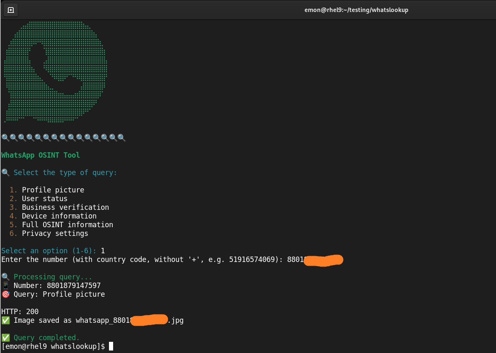

<h1 align="center">WHATS LOOKUP 🕵️‍♂️</h1>

<p align="center">
  <strong>OSINT tool for WhatsApp</strong> that allows obtaining profile pictures, 
  verifying Business accounts, checking status and user information, 
  analyzing linked devices, reviewing privacy settings, and 
  accessing complete data using the <strong>WhatsApp OSINT</strong> API from RapidAPI.
  <br>
  Supports 6 endpoints: <em>about, base64, business, devices, doublecheck, privacy</em>.
</p>

<p align="center">
  
</p>

<p align="center">
  
  
  
</p>

---

## 🚀 Features

- Obtain WhatsApp profile pictures using phone number
- Verification of WhatsApp Business accounts
- Query user status and information
- Analysis of linked devices
- Complete OSINT information
- Privacy settings inspection
- Automatic validation of phone number format
- Support for international numbers (with country code)
- Terminal interface with interactive menu and colors
- Automatic saving of images in JPG format
- Detection of profiles without a profile picture or hidden ones

## 📌 Requirements

- Python 3.8+

- Libraries: `requests`, `python-dotenv`, `colorama`

# 🔑 API Key (RapidAPI)

NAME | KEY |
| ------------------- |-------------- |
| [Whatsapp OSINT](https://rapidapi.com/inutil-inutil-default/api/whatsapp-osint) |  🔑 (Required) |

- Choose a plan → [Basic](https://rapidapi.com/inutil-inutil-default/api/whatsapp-osint/pricing)  
- Copy your **API Key**  
- Rename the file `.env.example` to `.env`  
- Add your API Key in the `.env` file  

### 🛠️ Step 1: Configure the .env file with your API

In the root of your project run:
```bash
cp .env.example .env
```
🔹 This creates a new file named `.env` with the same contents as `.env.example`.  

🔹 `.env.example` remains intact (serves as a template).  

### 🛠️ Step 2: Open the .env file to edit

Use nano (or your preferred editor like vim or VS Code):
```bash
nano .env
```

### 🛠️ Step 3: Edit the variables

Inside nano you’ll see something like this (example):

```
RAPIDAPI_KEY=your_api_key_here
```

👉 You need to fill in the correct values for your local environment.  
Example:

```
RAPIDAPI_KEY=yysnssksls536m3mdlldldmdddlld
```

### 🛠️ Step 4: Save changes in nano

- Press Ctrl + O → means “Write Out” (save).  
- It will ask you to confirm the file name (.env), press Enter.  
- Exit the editor with Ctrl + X.  

### 🛠️ Step 5: Verify it was saved

Run:
```bash
cat .env
```

## ⚠️ Usage Warning

This tool was created exclusively for:

- Legitimate cybersecurity investigations  
- Authorized security audits  
- OSINT projects for educational purposes  
- Analysis with explicit consent  

🔴 **Do not use this tool for illegal activities, harassment, or without people’s consent.**  

🟢 **The author is not responsible for the misuse that others may give it.**

---
## ⚙️ Installation

Clone the repository:

```bash
git clone https://github.com/HackUnderway/whatslookup.git
```
```bash
cd whatslookup
```
```bash
pip install -r requirements.txt
```

## 🐍 Basic usage 
##### Run the script:
```bash
python3 whats_lookup.py
```
- Select an option from the menu (1-6)  
- Enter the phone number with country code (e.g.: 51987654321)  
- The tool will validate the format and perform the query  
- Results will be displayed according to the selected query type  

<p align="center">
  
</p>

> **The project is open to contributors.**

# SUPPORTED DISTRIBUTIONS
|Distribution | Verified version | Supported? | Status |
|--------------|-----------------|------------|--------|
|Kali Linux| 2025.2 | yes | working   |
|Parrot Security OS| 6.3 | yes | working   |
|Windows| 11 | yes | working   |
|BackBox| 9 | yes | working   |
|Arch Linux| 2024.12.01 | yes | working   |

# SUPPORT
Questions, errors, or suggestions: info@hackunderway.com

# LICENSE
- [x] Whats Lookup is licensed.  
- [x] See the file [LICENSE](https://github.com/HackUnderway/whatslookup#MIT-1-ov-file) for more information.  

# CYBERSECURITY RESEARCHER

* [Victor Bancayan](https://www.offsec.com/bug-bounty-program/) - (**CEO at [Hack Underway](https://hackunderway.com/)**) 

## 🔗 LINKS
[](https://www.patreon.com/c/HackUnderway)
[](https://hackunderway.com)
[](https://www.facebook.com/HackUnderway)
[](https://www.youtube.com/@JeyZetaOficial)
[](https://x.com/JeyZetaOficial)
[](https://instagram.com/hackunderway)
[](https://tryhackme.com/p/JeyZeta)

## ☕️ Support the project

If you like this tool, consider buying me a coffee:

[](https://www.buymeacoffee.com/hackunderway)

## 🌞 Subscriptions

###### Subscribe to: [Jey Zeta](https://www.facebook.com/JeyZetaOficial/subscribe/)

[](https://www.kali.org/)

from  made in  with  by: <font color="red">Victor Bancayan</font>

© 2025
